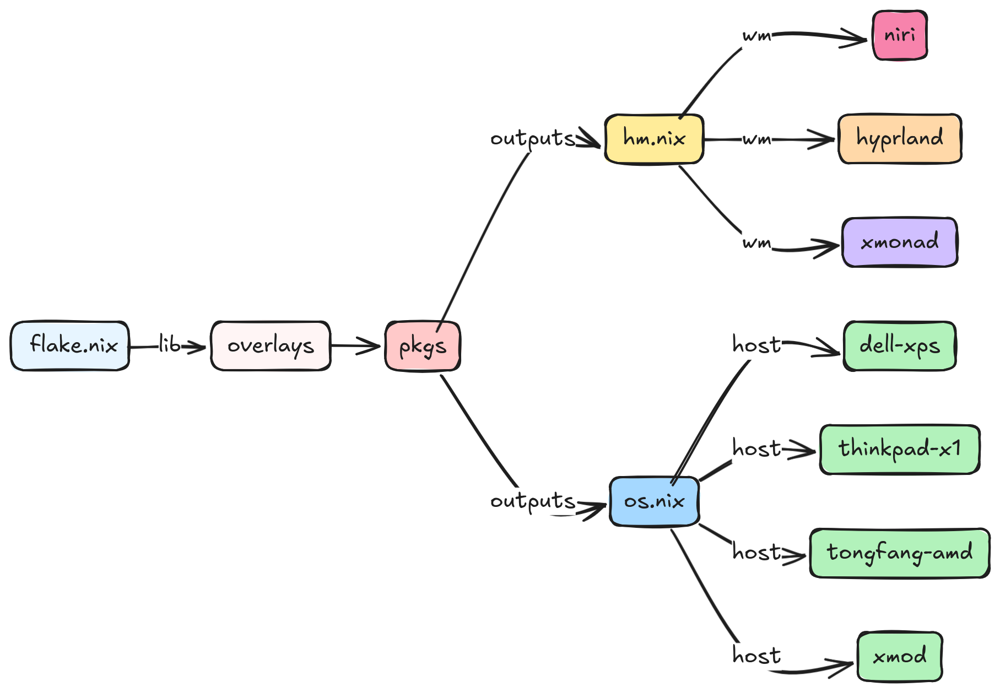

<div align="center">


# NixOS Config

[](https://lnhutnam.github.io)
[](https://github.com/namlnhut/dot-nixconfig/actions/workflows/home.yml)
[](https://github.com/namlnhut/dot-nixconfig/actions/workflows/nixos.yml)
[](https://garnix.io)

My current — and always evolving — [NixOS](https://nixos.org/) and [Home Manager](https://github.com/nix-community/home-manager/) configurations.

</div>

## :pray: Acknowledgments

This configuration is based on the excellent work by [Gabriel Volpe (@gvolpe)](https://github.com/gvolpe).

**Original repository:** [gvolpe/nix-config](https://github.com/gvolpe/nix-config)

Special thanks to Gabriel for creating such a well-structured, modular, and comprehensive NixOS configuration that serves as an excellent foundation for learning and building upon. His work has been invaluable in helping me understand the power and flexibility of NixOS and Nix flakes.

## :desktop_computer: My Configurations

This repository contains configurations for multiple window managers and desktop environments, all managed declaratively with Nix.

### Supported Systems

- **msi-gl63** - My main MSI GL63 laptop

### Available Environments

#### :globe_with_meridians: Desktop Environments

**XFCE** - Traditional, lightweight desktop
- XFCE panel with plugins (pulseaudio, battery, clipman, whiskermenu)
- Thunar file manager
- LightDM display manager

**GNOME** - Modern, polished desktop
- GNOME Shell with extensions (dash-to-dock, appindicator, vitals)
- GTK4 applications
- GDM display manager

#### :window: Window Managers

**XMonad** - Tiling window manager (X11)
- Haskell-based configuration
- Polybar status bar
- Rofi launcher, Dunst notifications
- Alacritty terminal

**Hyprland** - Dynamic tiling Wayland compositor
- Modern Wayland compositor
- Waybar status bar
- Wofi launcher, Foot terminal
- Full animations and effects

**Niri** - Scrollable tiling Wayland compositor
- Unique scrollable workspace paradigm
- Waybar status bar
- Fuzzel launcher, Kitty terminal
- SwayNC notifications

## :rocket: Quick Start

### System & Home Manager Rebuild

**Home Manager is integrated into NixOS.** A single command applies both system and user configurations:

```bash
cd ~/Sync/Config/Nix/nix-config

# Rebuild MSI GL63 system (includes home-manager)
sudo nixos-rebuild switch --flake .#msi-gl63

# Or use the switch script
./switch.sh msi
```

This will automatically:
- Update your NixOS system configuration
- Apply your home-manager configuration for the lnnam user
- Backup existing config files with `.backup` extension if conflicts occur

## :page_facing_up: Structure

[](https://excalidraw.com/#json=HN_V0f2FpcX4YZPR-FKzO,MJR6ILT6va5BZ0r5Yo41Zw)

### Directory Layout

```
nix-config/
├── flake.nix              # Main flake configuration
├── switch.sh              # Convenient switch script
├── home/                  # Home Manager configurations
│   ├── users/
│   │   └── lnnam/        # My user configurations
│   │       ├── shared.nix      # Shared settings
│   │       ├── xfce.nix        # XFCE config
│   │       ├── xmonad.nix      # XMonad config
│   │       ├── niri.nix        # Niri config
│   │       ├── hyprland.nix    # Hyprland config
│   │       └── gnome.nix       # GNOME config
│   ├── wm/               # Window manager configs
│   ├── programs/         # Program configurations
│   └── services/         # Service configurations
├── system/               # NixOS system configurations
│   ├── configuration.nix # Main system config
│   ├── machine/
│   │   └── msi-gl63/    # MSI GL63 laptop config
│   │       ├── default.nix
│   │       └── hardware-configuration.nix
│   └── wm/              # System-level WM configs
│       ├── xfce.nix
│       ├── xmonad.nix
│       ├── niri.nix
│       ├── hyprland.nix
│       └── gnome.nix
└── outputs/             # Flake outputs
    ├── os.nix          # NixOS configurations
    └── hm.nix          # Home Manager configurations
```

## :package: Flake Outputs

<details>
<summary>Expand to see available outputs</summary>

### NixOS Configurations (Primary Usage)

**Recommended: Use NixOS configurations with integrated home-manager**

- `msi-gl63` - MSI GL63 laptop with integrated home-manager
  - Switch WMs by editing `selectedWM` variable in `system/machine/msi-gl63/default.nix`
  - Rebuild with: `sudo nixos-rebuild switch --flake .#msi-gl63`

**Original gvolpe systems** (maintained for reference):
- `dell-xps` - Dell XPS 15 9560
- `thinkpad-x1` - ThinkPad X1 Carbon
- `tongfang-amd` - Tongfang AMD laptop
- `xmod` - Custom configuration

### Standalone Home Configurations (Optional/Reference)

**Note:** These are primarily for reference. The recommended approach is using NixOS integration above.

**lnnam user configurations:**
- `lnnam-xfce` - XFCE desktop environment
- `lnnam-xmonad` - XMonad window manager
- `lnnam-niri` - Niri scrollable compositor
- `lnnam-hyprland` - Hyprland dynamic tiling compositor
- `lnnam-gnome` - GNOME desktop environment

**Original gvolpe configurations:**
- `hyprland-edp` - Hyprland for laptop display
- `hyprland-hdmi` - Hyprland for external display
- `hyprland-hdmi-mutable` - Hyprland (mutable dotfiles)
- `xmonad-edp` - XMonad for laptop display
- `xmonad-hdmi` - XMonad for external display
- `niri-edp` - Niri for laptop display
- `niri-hdmi` - Niri for external display

### Packages

```console
$ nix flake show
├───homeConfigurations
│   ├───lnnam-gnome: Home Manager configuration
│   ├───lnnam-hyprland: Home Manager configuration
│   ├───lnnam-niri: Home Manager configuration
│   ├───lnnam-xfce: Home Manager configuration
│   ├───lnnam-xmonad: Home Manager configuration
│   ├───hyprland-edp: Home Manager configuration
│   ├───hyprland-hdmi: Home Manager configuration
│   ├───hyprland-hdmi-mutable: Home Manager configuration
│   ├───niri-edp: Home Manager configuration
│   ├───niri-hdmi: Home Manager configuration
│   ├───xmonad-edp: Home Manager configuration
│   └───xmonad-hdmi: Home Manager configuration
├───nixosConfigurations
│   ├───msi-gl63: NixOS configuration
│   ├───dell-xps: NixOS configuration
│   ├───thinkpad-x1: NixOS configuration
│   ├───tongfang-amd: NixOS configuration
│   └───xmod: NixOS configuration
└───packages
    └───x86_64-linux
        ├───bazecor: package
        ├───metals: package
        ├───metals-updater: package
        ├───neovim: package
        └───...
```

</details>

## :wrench: Configuration Details

### Integrated Home Manager

This configuration uses **NixOS module integration** for Home Manager:

- ✅ **Single command rebuild**: `sudo nixos-rebuild switch` applies both system and home-manager configs
- ✅ **Unified WM switching**: Change one variable (`selectedWM`) to switch window managers
- ✅ **Automatic backups**: Files are backed up with `.backup` extension when conflicts occur
- ✅ **Mutable dotfiles**: Symlinks point to `~/Sync/Config/Nix/nix-config/home/` for easy editing
- ✅ **Always in sync**: System and user configurations always match

Key configuration files:
- `outputs/os.nix:10` - Imports the home-manager NixOS module
- `system/machine/msi-gl63/default.nix:5` - **`selectedWM` variable for easy WM switching**
- `system/machine/msi-gl63/default.nix:42` - **`backupFileExtension = "backup"`** for automatic backups
- `home/users/lnnam/shared.nix:53` - **`dotfiles.path`** configured for correct symlinks

### System Features

- **Locale**: English (US) with Vietnamese regional formats
- **Timezone**: Asia/Ho_Chi_Minh
- **Bootloader**: systemd-boot with UEFI
- **Audio**: PipeWire with ALSA/PulseAudio compatibility
- **Network**: NetworkManager with OpenVPN support
- **Virtualization**: Docker with auto-pruning
- **Nix**: Flakes enabled, automatic garbage collection

### User Setup

- **User**: lnnam
- **Shell**: Fish
- **Groups**: wheel, networkmanager, docker, scanner, lp
- **Home Manager**: Separate configurations per environment

### Binary Caches

- **cache.nixos.org** - Official NixOS cache
- **cache.garnix.io** - Garnix CI cache (free builds)
- **namlnhut.cachix.org** - Personal Cachix cache

## :hammer_and_wrench: Installation

### Fresh NixOS Install

1. Boot from NixOS installation media
2. Partition and format your disk
3. Generate hardware configuration:
   ```bash
   nixos-generate-config --root /mnt
   ```
4. Clone this repository:
   ```bash
   git clone https://github.com/namlnhut/dot-nixconfig.git /mnt/etc/nixos/nix-config
   ```
5. Copy your hardware-configuration.nix:
   ```bash
   cp /mnt/etc/nixos/hardware-configuration.nix /mnt/etc/nixos/nix-config/system/machine/msi-gl63/
   ```
6. Install:
   ```bash
   nixos-install --flake /mnt/etc/nixos/nix-config#msi-gl63
   ```

### Existing NixOS System

1. Clone this repository:
   ```bash
   git clone https://github.com/namlnhut/dot-nixconfig.git ~/Sync/Config/Nix/nix-config
   cd ~/Sync/Config/Nix/nix-config
   ```

2. Update hardware-configuration.nix for your machine:
   ```bash
   sudo nixos-generate-config --show-hardware-config > system/machine/msi-gl63/hardware-configuration.nix
   ```

3. (Optional) Choose your preferred window manager by editing `system/machine/msi-gl63/default.nix`:
   ```nix
   selectedWM = "xmonad";  # or "niri", "gnome", "hyprland", "xfce"
   ```

4. Build and switch (applies both system and home-manager):
   ```bash
   sudo nixos-rebuild switch --flake .#msi-gl63
   ```

Home Manager is integrated and will be applied automatically with proper file backups!

## :computer: Environment Details

### Common Components

| Component | Program |
|-----------|---------|
| Editor | [NeoVim](https://neovim.io/) |
| Shell | [Fish](https://fishshell.com/) |
| Browser | [Firefox](https://www.mozilla.org/firefox/) |
| File Manager | Nautilus (XMonad), Nemo (Wayland), Thunar (XFCE) |
| Terminal Font | [JetBrainsMono Nerd Font](https://www.jetbrains.com/lp/mono/) |

### XFCE Setup

- **Display Manager**: LightDM
- **Panel**: XFCE Panel with plugins
- **Launcher**: Whisker Menu
- **Terminal**: XFCE Terminal
- **Screenshot**: Flameshot

### XMonad Setup

- **Status Bar**: Polybar
- **Launcher**: Rofi
- **Terminal**: Alacritty
- **Compositor**: Picom
- **Notifications**: Dunst
- **Screen Locker**: Multilockscreen

### Niri Setup

- **Status Bar**: Waybar
- **Launcher**: Fuzzel
- **Terminal**: Kitty
- **Notifications**: SwayNC
- **Wallpaper**: Waypaper + Hyprlax
- **Special Tools**: niri-scratchpad, nfsm

### Hyprland Setup

- **Status Bar**: Waybar
- **Launcher**: Wofi
- **Terminal**: Foot
- **Notifications**: Dunst
- **Screen Locker**: Hyprlock
- **Idle Manager**: Hypridle
- **Plugins**: Pyprland

### GNOME Setup

- **Display Manager**: GDM
- **Extensions**: Dash to Dock, AppIndicator, Vitals, Caffeine
- **File Manager**: Nautilus
- **Terminal**: GNOME Terminal

## :arrows_counterclockwise: Switching Between Window Managers

### Simple One-Variable Switch

Edit `system/machine/msi-gl63/default.nix` and change the `selectedWM` variable (line 5):

```nix
# Choose your window manager: "xmonad" | "niri" | "gnome" | "hyprland" | "xfce"
selectedWM = "niri";  # Change this to switch WMs
```

Then rebuild your system:

```bash
sudo nixos-rebuild switch --flake .#msi-gl63
```

The configuration will automatically:
- ✅ Update system-level WM services and packages
- ✅ Update user-level dotfiles and programs
- ✅ Backup conflicting files with `.backup` extension
- ✅ Create correct symlinks to `~/Sync/Config/Nix/nix-config/home/`

### Available Window Managers

| WM | Type | selectedWM Value |
|----|------|------------------|
| **XMonad** | Tiling (X11) | `"xmonad"` |
| **Niri** | Scrollable (Wayland) | `"niri"` |
| **GNOME** | Desktop (Wayland) | `"gnome"` |
| **Hyprland** | Dynamic Tiling (Wayland) | `"hyprland"` |
| **XFCE** | Desktop (X11) | `"xfce"` |

### Switch Script (Alternative)

```bash
# Rebuild system
./switch.sh msi

# Utilities
./switch.sh update-fish      # Update fish completions
./switch.sh update-nix-index # Update nix-index database
```

## :gear: Customization

### Adding a New Machine

1. Generate hardware configuration:
   ```bash
   sudo nixos-generate-config --dir ./system/machine/my-machine
   ```

2. Create machine configuration with integrated home-manager:
   ```nix
   # system/machine/my-machine/default.nix
   { pkgs, inputs, ... }:

   let
     # Choose your window manager: "xmonad" | "niri" | "gnome" | "hyprland" | "xfce"
     selectedWM = "xmonad";

     wmConfigs = {
       xmonad = {
         system = ../../wm/xmonad.nix;
         user = ../../../home/users/lnnam/xmonad.nix;
       };
       niri = {
         system = ../../wm/niri.nix;
         user = ../../../home/users/lnnam/niri.nix;
       };
       gnome = {
         system = ../../wm/gnome.nix;
         user = ../../../home/users/lnnam/gnome.nix;
       };
       hyprland = {
         system = ../../wm/hyprland.nix;
         user = ../../../home/users/lnnam/hyprland.nix;
       };
       xfce = {
         system = ../../wm/xfce.nix;
         user = ../../../home/users/lnnam/xfce.nix;
       };
     };

     currentWM = wmConfigs.${selectedWM};
   in
   {
     imports = [
       ./hardware-configuration.nix
       currentWM.system
     ];

     networking.hostName = "my-machine";

     # Home-manager integration
     home-manager = {
       useGlobalPkgs = true;
       useUserPackages = true;
       extraSpecialArgs = pkgs.xargs;
       backupFileExtension = "backup";

       users.lnnam = {
         imports = [
           inputs.neovim-flake.homeManagerModules.${pkgs.system}.default
           inputs.nix-index.homeManagerModules.${pkgs.system}.default
           currentWM.user
           {
             nix.registry.nixpkgs.flake = inputs.nixpkgs;
             hidpi = false;
             dotfiles.mutable = true;
           }
         ];
       };
     };

     # Boot loader
     boot = {
       kernelPackages = pkgs.linuxPackages_latest;
       loader = {
         systemd-boot.enable = true;
         efi.canTouchEfiVariables = true;
       };
     };

     system.stateVersion = "25.11";
   }
   ```

3. Add to outputs/os.nix:
   ```nix
   hosts = [ ... "my-machine" ];
   ```

### Changing Window Manager

The configuration uses a unified WM switching system. Simply change the `selectedWM` variable:

```nix
# system/machine/my-machine/default.nix
{ pkgs, inputs, ... }:

let
  # Choose your window manager: "xmonad" | "niri" | "gnome" | "hyprland" | "xfce"
  selectedWM = "niri";  # Just change this!

  wmConfigs = {
    xmonad = {
      system = ../../wm/xmonad.nix;
      user = ../../../home/users/lnnam/xmonad.nix;
    };
    niri = {
      system = ../../wm/niri.nix;
      user = ../../../home/users/lnnam/niri.nix;
    };
    gnome = {
      system = ../../wm/gnome.nix;
      user = ../../../home/users/lnnam/gnome.nix;
    };
    hyprland = {
      system = ../../wm/hyprland.nix;
      user = ../../../home/users/lnnam/hyprland.nix;
    };
    xfce = {
      system = ../../wm/xfce.nix;
      user = ../../../home/users/lnnam/xfce.nix;
    };
  };

  currentWM = wmConfigs.${selectedWM};
in
{
  imports = [
    ./hardware-configuration.nix
    currentWM.system  # Automatically loads correct system config
  ];

  home-manager = {
    useGlobalPkgs = true;
    useUserPackages = true;
    extraSpecialArgs = pkgs.xargs;
    backupFileExtension = "backup";  # Auto-backup conflicts

    users.lnnam = {
      imports = [
        inputs.neovim-flake.homeManagerModules.${pkgs.system}.default
        inputs.nix-index.homeManagerModules.${pkgs.system}.default
        currentWM.user  # Automatically loads correct user config
        {
          nix.registry.nixpkgs.flake = inputs.nixpkgs;
          hidpi = false;
          dotfiles.mutable = true;
        }
      ];
    };
  };
}
```

Then rebuild:
```bash
sudo nixos-rebuild switch --flake .#my-machine
```

**Benefits:**
- ✅ Single variable change switches both system and user configs
- ✅ No chance of mismatched WM configs
- ✅ Automatic file backups with `.backup` extension
- ✅ Mutable dotfiles with correct symlink paths

## :wrench: Troubleshooting

### File Conflicts When Switching WMs

When you see errors like:
```
Existing file '/home/lnnam/.config/foo' would be clobbered
```

**Solution:** The `backupFileExtension = "backup"` is already configured! This happens when you have unmanaged files (files you created manually). The rebuild will automatically back them up with `.backup` extension.

Just run the rebuild again and check the backed up files:
```bash
sudo nixos-rebuild switch --flake .#msi-gl63
find ~/.config ~/.mozilla -name "*.backup" -type f 2>/dev/null
```

### Symlinks Not Pointing to Correct Path

If symlinks point to `~/workspace/nix-config/` instead of `~/Sync/Config/Nix/nix-config/`:

**Solution:** This is already fixed in `home/users/lnnam/shared.nix:53`:
```nix
dotfiles.path = "${homeDirectory}/Sync/Config/Nix/nix-config/home";
```

Rebuild to apply:
```bash
sudo nixos-rebuild switch --flake .#msi-gl63
```

### Check Current WM Configuration

To see which WM is currently selected:
```bash
cat system/machine/msi-gl63/default.nix | grep selectedWM
```

To verify symlinks are correct:
```bash
# For Niri
ls -la ~/.config/niri/config.kdl

# For Hyprland
ls -la ~/.config/hypr/

# For XMonad
ls -la ~/.config/xmonad/
```

## :books: Resources

- [NixOS Manual](https://nixos.org/manual/nixos/stable/)
- [Home Manager Manual](https://nix-community.github.io/home-manager/)
- [Nix Flakes](https://nixos.wiki/wiki/Flakes)
- [Original gvolpe/nix-config](https://github.com/gvolpe/nix-config) - The foundation of this config

## :memo: LICENSE

Licensed under the Apache License, Version 2.0 (the "License"); you may not use this project except in compliance with the License. You may obtain a copy of the License at http://www.apache.org/licenses/LICENSE-2.0.

Unless required by applicable law or agreed to in writing, software distributed under the License is distributed on an "AS IS" BASIS, WITHOUT WARRANTIES OR CONDITIONS OF ANY KIND, either express or implied. See the License for the specific language governing permissions and limitations under the License.
